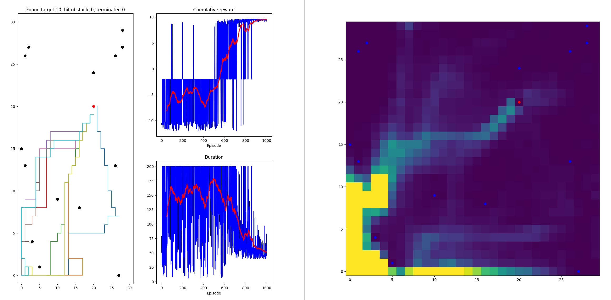
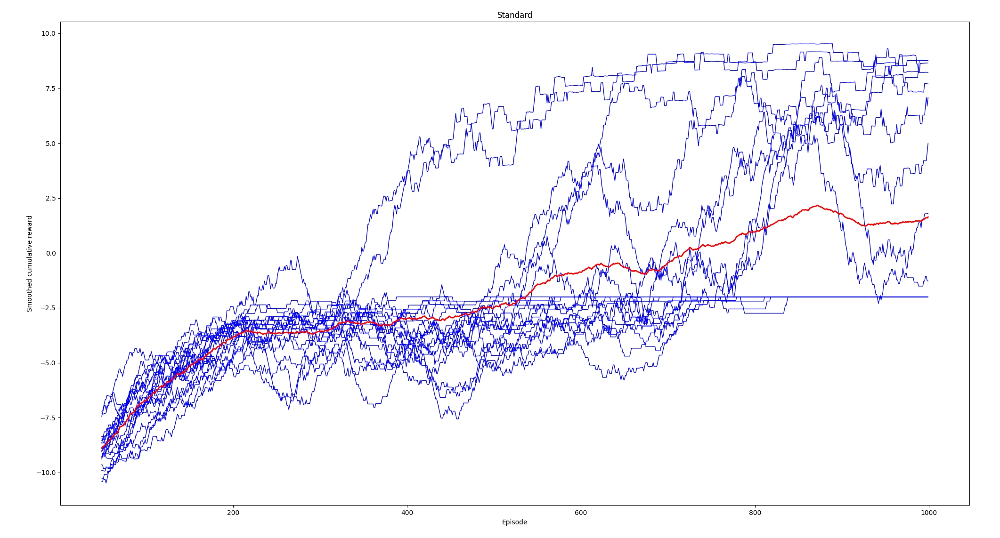
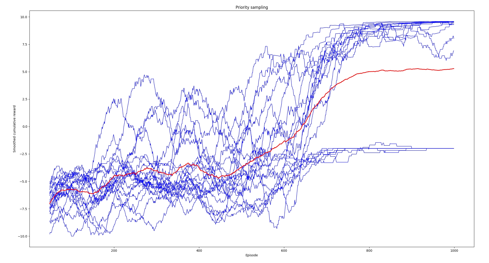
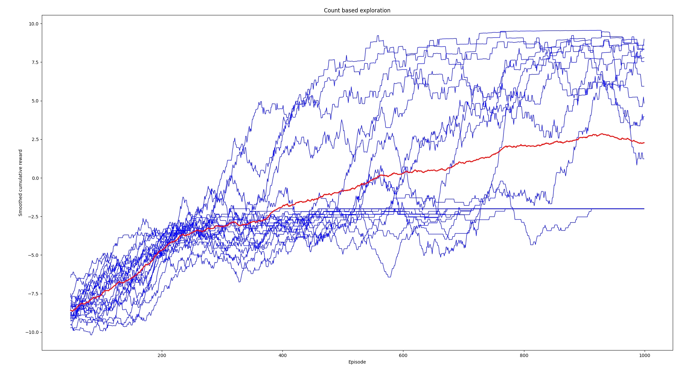
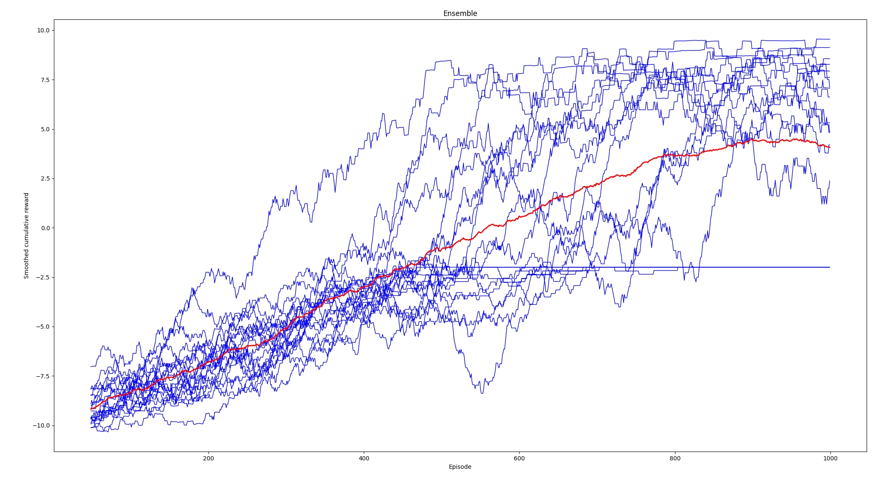
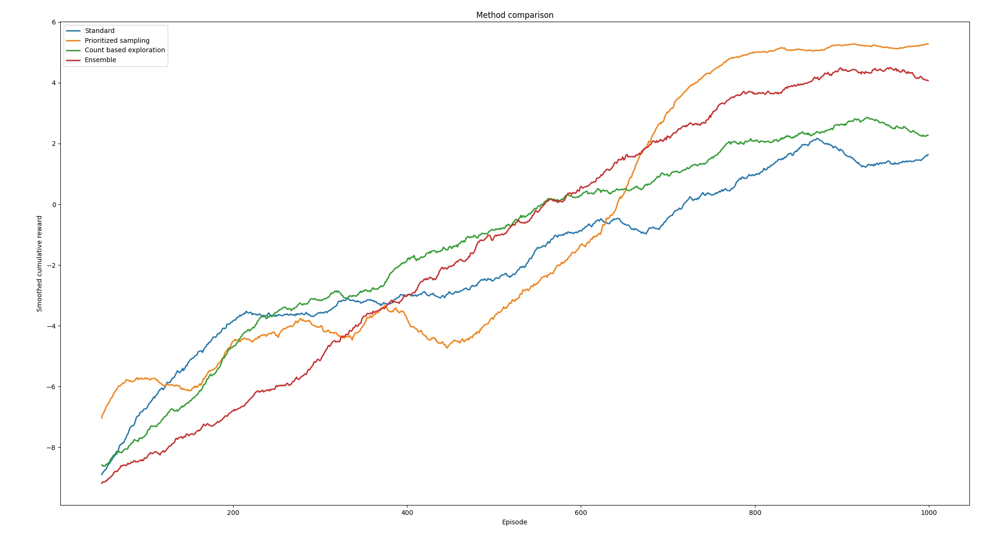

# DQN

This is a hobby project to learn DQN reinforcement learning.

The implementation is quite standard DQN, including
- Simple feedforward network to approximate state-value function
- Replay memory
- Separate target network that is "smoothed" version of policy net

I'm planning to add some experimental features. Now there are few
- Option for ensemble learning
  - Voting best action based on multiple models
  - Finding most uncertain actions in exploration phase using multiple models
- Option for adding reward bonus based on (hashed) state count as exploration strategy
- Option to use priority based sampling from replay memory; priority defined by temporal difference error

# Examples

## Grid world with obstacles

**Game**
* Grid world, 30 x 30
* One target and 15 obstacles
* Rewards:
  * target: +10
  * obstacle: -10
  * otherwise: -0.01
* Robot starts from (0,0) and has 200 steps time to find target at (20, 20)

**Testing**
* Test done with for different methods:
  * Standard
  * Priority sampling, based on temporal difference errors
  * Count based exploration
  * Ensemble
* For each method, the run is repeated 20 times
* Each run is 1000 episodes
* Smoothed (running mean, 50 episodes) reward is calculated for each run

See details: src/samples/sample_method_comparison.py

**Results**

Example run (method: priority sampling):

20 runs with standard DQN: 

20 runs with priority sampling: 

20 runs with count based exploration: 

20 runs with ensemble: 

Comparison of methods, average of 20 runs from each:

# References

**Prioritized Experience Replay**

Tom Schaul, John Quan, Ioannis Antonoglou, David Silver

http://arxiv.org/abs/1511.05952

**#Exploration: A Study of Count-Based Exploration for Deep Reinforcement Learning**

Haoran Tang, Rein Houthooft, Davis Foote, Adam Stooke, Xi Chen, Yan Duan, John Schulman, Filip De Turck, Pieter Abbeel

https://arxiv.org/abs/1611.04717