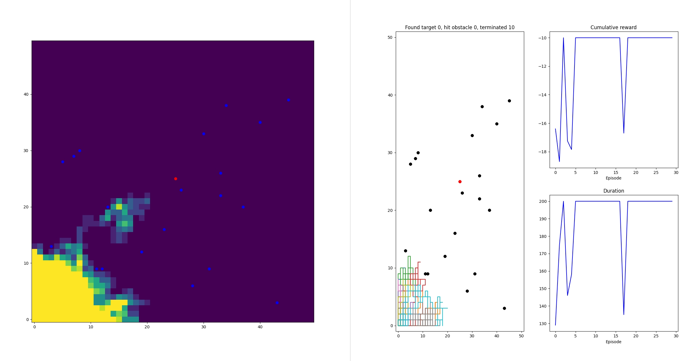
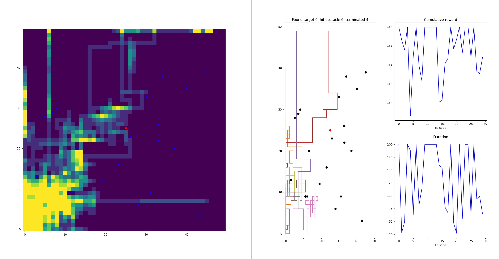

# DQN

This is a hobby project to learn DQN reinforcement learning.

The implementation is quite standard DQN, including
- Simple feedforward network to approximate state-value function
- Replay memory
- Separate target network that is "smoothed" version of policy net

I'm planning to add some experimental features. Now there are few
- Option for ensemble learning
  - Voting best action based on multiple models
  - Finding most uncertain actions in exploration phase using multiple models
- Option for adding reward bonus based on (hashed) state count as exploration strategy
- Option to use priority based sampling from replay memory; priority defined by temporal difference error

# Examples

Find a target in the map with obstacles (src/samples/sample_grid_world_dqn).

First episodes with standard epsilon-greedy action selection strategy: 

First episodes with ensemble "find most uncertain sample" strategy: 

